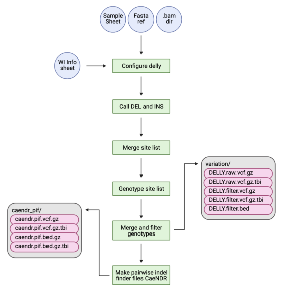

# sv-nf

*A nextflow pipeline to call structural variants in Caenorhabditis nematodes from .bam files*

## Pipeline overview
<p align="center" width="100%">
    
</p>
##

## QUEST usage

The current version of `sv-nf v0.1.0` is limited to building the `.bed` and `.vcf` files required for the CaeNDR pairwise-indel finder tool. Follow the usage below to generate the files. Note, the R libraries required to run this version of the pipeline are set by default to `/projects/b1059/software/R_lib_3.6.0`. This solution is known to be unstable and will be updated in the next version.

```
# clone the repo
git clone <https://github.com/AndersenLab/sv-nf.git>
cd sv-nf

# setup environment
module load python/anaconda3.6
module load singularity
source activate /projects/b1059/software/conda_envs/nf20_env/

# example run for latest CeNDR release
nextflow run main.nf --release 20220216
```

## sv-nf help

```bash
S V - N F    P I P E L I N E
===============================================
Usage:
The typical command for running the pipeline is as follows:
nextflow run main.nf --release <latest CaeNDR release>

Arguments:
--release     String           The 8-digit date code for CaeNDR release, e.g 20220216
--sp_sheet    String           A path to the sample_sheet.txt file for calling INDELs instead of release
--bam_dir     String           The path to the .bam directory, default set for QUEST
--ref         String           Full path to the .fa uncompressed reference file, default set for QUEST
--out         String           The output directory, default is SV_indel_results_<date>
--debug       boolean          Run the debug or not, default is FALSE
--rlib        String           A path to an R v3.6.0 library with required R packages installed, default is /projects/b1059/software/R_lib_3.6.0

Flags:
--help                                      Display this message
```
